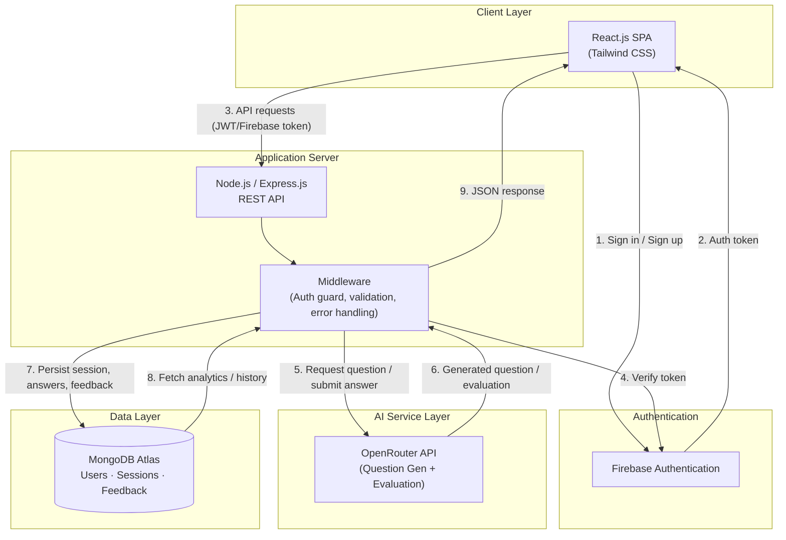
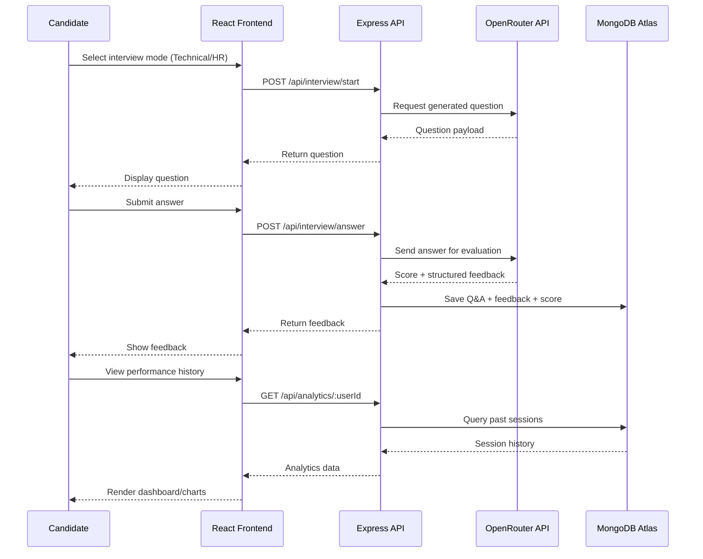

# InterviewIQ 🎯

**AI-Powered Mock Interview Platform**

InterviewIQ is a full-stack web application that helps candidates prepare for job interviews through AI-generated questions, real-time response evaluation, and structured feedback — across both **Technical** and **HR** interview modes.

[Live Demo](https://intervie-wiq-clientside.onrender.com/) 

---


---

## 🧭 Overview

InterviewIQ simulates a realistic mock-interview experience. Candidates choose a mode (Technical or HR), answer AI-generated questions, and receive instant, structured feedback on their responses — reducing manual interview-prep effort by an estimated **70%**.

The platform combines:
- A **React.js** single-page frontend for a smooth, responsive UX
- A **Node.js/Express.js** REST API backend
- **MongoDB Atlas** for persistent user and performance data
- **Firebase Authentication** for secure sign-in/session management
- The **OpenRouter API** to power AI question generation and answer evaluation

---

## ✨ Features

- 🔐 **Secure Authentication** — Firebase-based sign-up/login and session handling
- 🧑‍💻 **Two Interview Modes** — Technical (DSA/CS fundamentals/role-specific) and HR (behavioral/situational)
- 🤖 **AI Question Generation** — Dynamic, non-repetitive questions generated via the OpenRouter API
- 📝 **Automated Response Evaluation** — AI scores and critiques each answer in real time
- 📊 **Structured Feedback Reports** — Strengths, weaknesses, and improvement tips per session
- 📈 **Performance Analytics** — Persistent history of past interviews and score trends stored in MongoDB
- 📱 **Responsive UI** — Built with Tailwind CSS for a clean experience across devices

---

## 🛠 Tech Stack

| Layer            | Technology                                   |
|-------------------|-----------------------------------------------|
| Frontend          | React.js, Tailwind CSS                        |
| Backend           | Node.js, Express.js                           |
| Database          | MongoDB Atlas                                 |
| Authentication    | Firebase Authentication                       |
| AI / LLM Layer    | OpenRouter API                                |
| Hosting (suggested)| Vercel (frontend) · Render/Railway (backend) |

---

## 🏗 System Architecture



**How it works, step by step:**
1. The candidate logs in via Firebase Authentication on the React frontend.
2. The frontend calls the Express REST API with the authenticated user's token for every request.
3. The API layer validates the token, then talks to the OpenRouter API to generate interview questions (Technical or HR mode).
4. As the candidate answers, responses are sent to the backend, which forwards them to OpenRouter for evaluation and structured feedback generation.
5. Questions, answers, scores, and feedback are persisted in MongoDB Atlas, tied to the user's profile.
6. Performance analytics (past sessions, score trends) are fetched from MongoDB and rendered back on the dashboard.

---

## 🔄 Data Flow



---

## 🗄 Database Schema (MongoDB)

```text
users
 ├─ _id
 ├─ firebaseUid
 ├─ name
 ├─ email
 └─ createdAt

interviewSessions
 ├─ _id
 ├─ userId (ref: users)
 ├─ mode            // "technical" | "hr"
 ├─ startedAt
 ├─ completedAt
 └─ overallScore

responses
 ├─ _id
 ├─ sessionId (ref: interviewSessions)
 ├─ question
 ├─ candidateAnswer
 ├─ aiScore
 ├─ aiFeedback
 └─ createdAt
```

> Adjust field names above to match your actual Mongoose schemas.

---

## 🚀 Getting Started

### Prerequisites
- Node.js (v18+)
- npm or yarn
- MongoDB Atlas account & connection string
- Firebase project (Authentication enabled)
- OpenRouter API key

### Installation

```bash
# Clone the repository
git clone https://github.com/Shivamgupta-anj/InterviewIQ.git
cd InterviewIQ

# Install backend dependencies
cd server
npm install

# Install frontend dependencies
cd ../client
npm install
```

### Running Locally

```bash
# Start backend (from /server)
npm run dev

# Start frontend (from /client, in a separate terminal)
npm start
```

The frontend will typically run on `http://localhost:3000` and the backend on `http://localhost:5000` (adjust based on your config).

---

## 🔑 Environment Variables

Create a `.env` file in the `/server` directory:

```env
PORT=5000
MONGODB_URI=your_mongodb_atlas_connection_string
FIREBASE_PROJECT_ID=your_firebase_project_id
FIREBASE_CLIENT_EMAIL=your_firebase_client_email
FIREBASE_PRIVATE_KEY=your_firebase_private_key
OPENROUTER_API_KEY=your_openrouter_api_key
```

Create a `.env` file in the `/client` directory:

```env
REACT_APP_FIREBASE_API_KEY=your_firebase_api_key
REACT_APP_FIREBASE_AUTH_DOMAIN=your_firebase_auth_domain
REACT_APP_FIREBASE_PROJECT_ID=your_firebase_project_id
REACT_APP_API_BASE_URL=http://localhost:5000/api
```

> ⚠️ Never commit `.env` files. Add them to `.gitignore`.

---

## 📁 Project Structure

```
InterviewIQ/
├── client/                 # React frontend
│   ├── src/
│   │   ├── components/
│   │   ├── pages/
│   │   ├── context/
│   │   ├── services/        # API calls
│   │   └── App.js
│   └── package.json
│
├── server/                  # Express backend
│   ├── config/               # DB & Firebase config
│   ├── controllers/
│   ├── middleware/           # Auth, error handling
│   ├── models/                # Mongoose schemas
│   ├── routes/
│   ├── services/              # OpenRouter integration
│   └── server.js
│
└── README.md
```

---

## 📡 API Reference

| Method | Endpoint                     | Description                              | Auth Required |
|--------|-------------------------------|-------------------------------------------|----------------|
| POST   | `/api/auth/verify`            | Verify Firebase token, create/fetch user  | No             |
| POST   | `/api/interview/start`        | Start a new session, get first question   | Yes            |
| POST   | `/api/interview/answer`       | Submit an answer, get AI evaluation       | Yes            |
| GET    | `/api/interview/:sessionId`   | Get details of a specific session         | Yes            |
| GET    | `/api/analytics/:userId`      | Get performance history & score trends    | Yes            |

> Update this table to match your actual route definitions.

---

## 🗺 Roadmap

- [ ] Add voice-based answer input (speech-to-text)
- [ ] Support additional interview modes (System Design, Behavioral+)
- [ ] Add resume-based personalized question generation
- [ ] Export feedback reports as PDF
- [ ] Add leaderboard / peer comparison

---

## 🤝 Contributing

Contributions are welcome!

1. Fork the repository
2. Create your feature branch (`git checkout -b feature/AmazingFeature`)
3. Commit your changes (`git commit -m 'Add some AmazingFeature'`)
4. Push to the branch (`git push origin feature/AmazingFeature`)
5. Open a Pull Request

---

## 📄 License

Distributed under the MIT License. See `LICENSE` for more information.

---

## 📬 Contact

**Shivam Gupta**
- Email: guptashivam9161@gmail.com
- LinkedIn: [shivam-gupta-a302712b7](https://www.linkedin.com/in/shivam-gupta-a302712b7/)
- GitHub: [@Shivamgupta-anj](https://github.com/Shivamgupta-anj)
- Portfolio: [portfolio-bay-nu-36.vercel.app](https://portfolio-bay-nu-36.vercel.app/)
